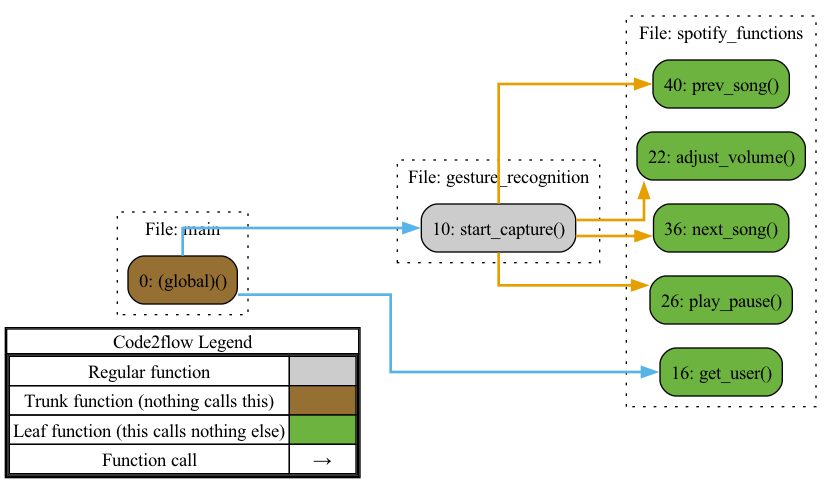

Module Name: spotify_functions.py

**Primary Objectives:**
The module provides functions to interact with the Spotify API for music playback control. It allows adjusting volume, play/pause music, skip songs, and retrieve the connected user's Spotify username.

**Critical Functions:**
1. `get_user()`: Retrieves the connected user's Spotify username.
2. `adjust_volume(vol_percent)`: Adjusts the volume of music playback to a given percentage.
3. `play_pause()`: Starts or pauses the music playback based on the current status.
4. `next_song()`: Skips to the next song in the queue.
5. `prev_song()`: Goes back to the previous song in the queue.

**Key Variables:**
1. `SPOTIPY_CLIENT_ID`: Spotify API client ID.
2. `SPOTIPY_CLIENT_SECRET`: Spotify API client secret.
3. `SPOTIPY_REDIRECT_URI`: Redirect URI for the Spotify API.
4. `scope`: Scope of Spotify API access.
5. `p`: Spotipy object for interacting with the Spotify API.

**Interdependencies:**
This module depends on the Spotipy library and the Spotify API for proper functionality.

**Core vs. Auxiliary Operations:**
Core operations include adjusting volume, play/pause, skipping songs, and retrieving the user's username. The creation of the Spotipy object is an auxiliary operation.

**Operational Sequence:**
1. Create the Spotipy object.
2. Retrieve the connected user's Spotify username.
3. Adjust the volume of music playback.
4. Start or pause the music playback.
5. Skip to the next song.
6. Go back to the previous song.

**Performance Aspects:**
The module's performance relies on the Spotipy library and the Spotify API. The functions are simple and shouldn't significantly impact performance.

**Reusability:**
This module is designed to be reusable and adaptable for projects requiring Spotify API integration for music playback control.

Module Name: gesture_recognition.py

**Primary Objectives:**
The module recognizes hand gestures and uses them to control Spotify music playback.

**Critical Functions:**
The main function of the module is `start_capture()`, which captures webcam frames, detects hand landmarks, recognizes gestures, and controls Spotify playback.

**Key Variables:**
- `mp_hand_drawing`: Variable for drawing hand landmarks.
- `mp_hands`: Variable for hand tracking.
- `mediaCap`: Variable for webcam capture feed.
- `max_distance`: Variable for volume control.
- `play_pause_active`: Boolean variable to avoid repeated play/pause actions.
- `next_prev_active`: Boolean variable to avoid repeated next/prev song actions.
- `finger_tip_ids`: List of finger tip landmarks (excluding thumb).
- `finger_count`: Dictionary tracking the number of fingers up on each hand.
- `finger_up`: Dictionary detecting finger status (up or down) in captured frames.
- `ui_color`: Variable defining UI element color.
- `font`: Variable defining UI element font.

**Interdependencies:**
The module relies on the mediapipe library for hand landmark detection and the spotify_functions module for Spotify playback control.

**Core vs. Auxiliary Operations:**
The core operation is gesture recognition and Spotify playback control, while there are no auxiliary operations.

**Operational Sequence:**
The `start_capture()` function captures webcam frames, processes them for hand detection, recognizes gestures, and controls Spotify playback.

**Performance Aspects:**
Module performance depends on computer speed, webcam quality, and a stable internet connection for Spotify playback control.

**Reusability:**
The module can be adapted for reuse by modifying gestures or using hand landmarks for other purposes.

Module Name: main.py

**Primary Objectives:**
The module enables gesture control for a Spotify account by utilizing the functions from gesture_recognition and spotify_functions modules.

**Critical Functions:**
- `get_user()`: Prompts the user to enter their Spotify account username.
- `start_capture()`: Captures user gestures using the webcam until the program is stopped.

**Key Variables:**
- `username`: Stores the user's Spotify account username obtained from `get_user()`.

**Interdependencies:**
The module depends on the gesture_recognition and spotify_functions modules for their functions.

**Core vs. Auxiliary Operations:**
The core operation is enabling gesture control for a Spotify account, while prompting the user and capturing gestures are auxiliary operations.

**Operational Sequence:**
The module imports required modules, prompts the user to enter their Spotify account username, and starts capturing gestures using `start_capture()`.

**Performance Aspects:**
Module performance relies on webcam quality, computer processing power, and the speed and accuracy of gesture recognition.

**Reusability:**
The module can be reused for any Spotify account by prompting the user to enter their account username. Gesture_recognition and spotify_functions modules may require modification if gestures or Spotify API changes.

Module Overview:

1. spotify_functions.py:
   - **Primary Responsibilities:** Provides functions to interact with the Spotify API for music playback control.
   - **Interaction Points:** Spotify API, Spotipy library.
   - **Architectural Layer:** Application Layer.
   - **Role:** Handles Spotify API integration and provides essential functions for music playback control.

2. gesture_recognition.py:
   - **Primary Responsibilities:** Recognizes hand gestures and uses them to control Spotify music playback.
   - **Interaction Points:** Mediapipe library (hand detection), spotify_functions module.
   - **Architectural Layer:** Presentation Layer.
   - **Role:** Handles gesture recognition using hand landmarks and facilitates Spotify playback control.

3. main.py:
   - **Primary Responsibilities:** Enables gesture control for a Spotify account by utilizing functions from gesture_recognition and spotify_functions modules.
   - **Interaction Points:** gesture_recognition module, spotify_functions module.
   - **Architectural Layer:** Presentation Layer.
   - **Role:** Orchestrates the process of enabling gesture control, including capturing user gestures and authenticating the Spotify account.

Note: The architectural layer assignment is based on the provided information and may vary depending on the overall system architecture.

## Flow Map (Py)

